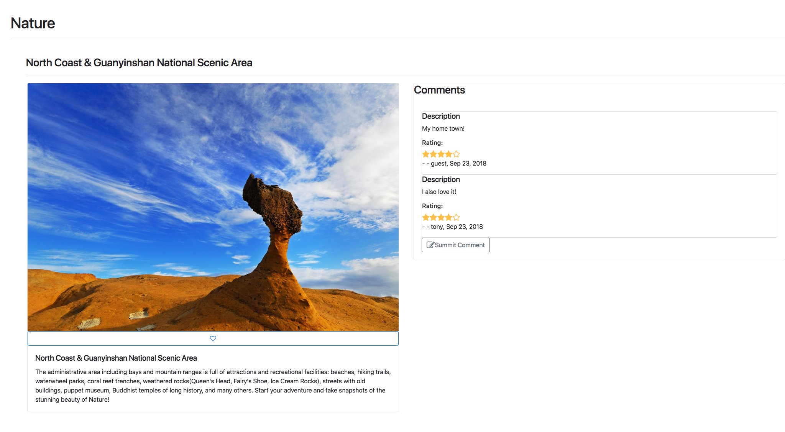
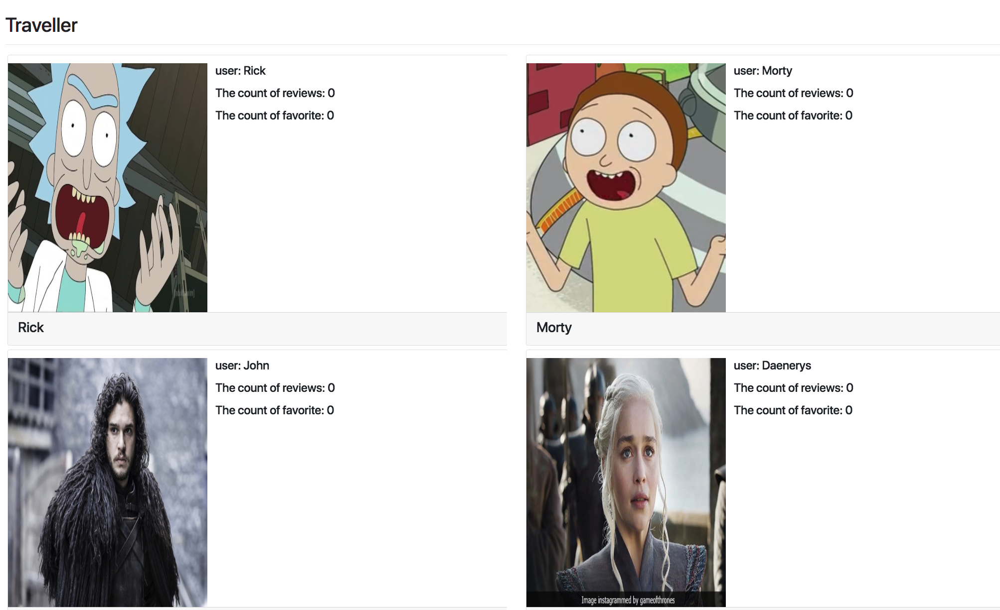

## How to run
### server side
`cd server`
#### install
`npm install`
#### launch server on port 3001
`node server/app.js`

### client side
`cd client`
#### install and build
if you do not have yarn
- `sudo npm install -g yarn` 
- `yarn install`
- `serve -s build`
- `yarn global add serve`
### launch client on port 5000
- `serve -s build`

## DEMO 

